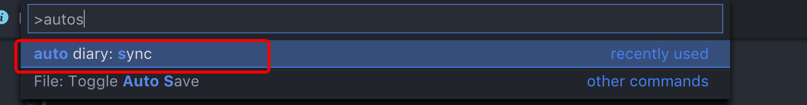
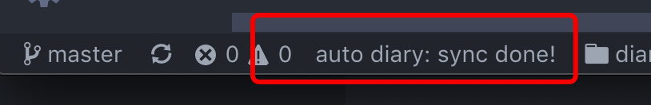

# auto diary


> 面向程序员的日记同步插件


使用这个插件，可以通过简单的配置，让日记同步起来。

面向的用户：

1. 会使用 git 的程序员
2. 使用 vscode 作为码字工具的人

## 配置

只需要在 workspace 根目录增加一个配置文件：

**.auto-diary.json**

配置内容：

``` json
{
    "branch": "master",
    "remote": "git@github.com/xxxx/xxxx" //git仓库地址
}
```

试着 reload window 或者 输入命令:



会自动同步远程仓库，


接着试着编辑仓库中任意文件，插件会自动 commit 并且 push 到远程仓库。



就是这么简单。

带来的便利：

1. 不用重复 commit + push，插件自动完成
2. 忘了保存也没关系，配合 vscode 的 autosave，自动推送到远程仓库，告别收费的日记软件吧！