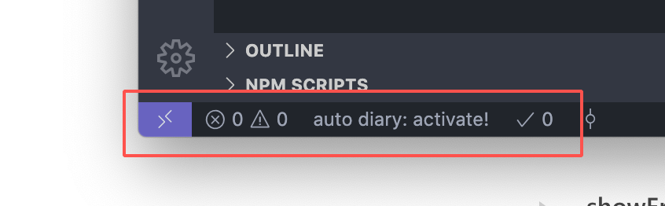

# auto diary


> 面向程序员的日记同步插件

使用这个插件，可以通过简单的配置，让日记同步起来。

面向的用户：

1. 会使用 git 的程序员
2. 使用 vscode 作为码字工具的人

## 相关术语

打开 vscode 控制台：即使用`ctrl+shift+p`打开命令控制台

## 配置

只需要在**想要作为日记本的**根目录增加一个配置文件：**auto-diary.json**。
然后打开 vscode 控制台，输入`reload window`。

如果此时看到 vscode 左下角出现提示：

那么就意味着此插件初始化成功。接下来在**auto-diary.json**中输入具体配置即可。

### 配置示例

```json
{
  "remote": "git@github.com/xxxx/xxxx"
}
```

解析：

- remote: 即为想要作为日记本 git 仓库的远端地址，根据实际情况而定

> 一定要确保本地计算机配置能够正常`push/pull`代码

## 使用

打开 vscode 控制台，使用`auto diary:sync`同步日记本。

以下是同步成功的提示

接着编辑仓库中任意文件，然后保存，插件会自动将本次修改的内容推送到远端，从而达到了远程同步的效果。


## 带来的便利

1. 不用重复 commit + push，插件自动完成
2. 忘了保存也没关系，配合 vscode 的 autosave，自动推送到远程仓库，告别收费的日记软件吧！
